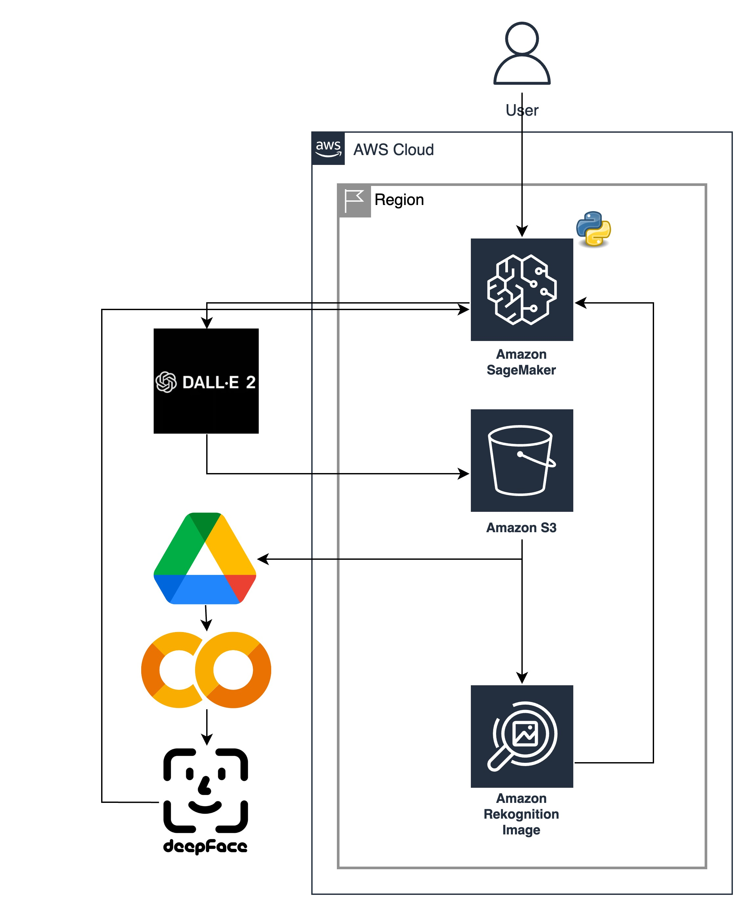

# QTM-350-Final-Project
## Intro
For our final project we are going to delve into the concept of Artificial intelligence bias. Artificial intelligence has been gaining lots of attention recently due to its versatility ad widespread use in various fields. Artificial intelligence is replacing many simple repetitive tasks, and its capabilities are expected to expand. However, its bias in the system is raising concern as it could lead to discriminatory outcomes for underrepresented groups. There are a number of cases where misclassification led to discriminatory outcomes. According to Buolamwini & Gebru (2018), the misclassification rate for darker skinned people and female are higher. Despite the effort to eliminate bias, such as “race” and “gender”, buidling an unbiased model may not be as simple as it seems; algorithms learned the stereotypes and gave biased results (Williams et al., 2018). Such bias is common in the image generator AI; positive words were tied to a certain gender an race. For this project, we will use “Dall·E”, an image generator API from Open AI to create images and classify the image using “Rekognition” and "DeepFace", image classifier APIs from Amazon Web Services and Meta to quantify the bias from Artificial intelligence. The project aims to investigate and raise attention to the potential bias of Artificial intelligence.

## 1. Data Generation
The first step is to prepare the data. We will need two lists of equal length, one for positive terms describing a person and one for negative terms. For example, we could use the following lists:

```
positive_list = ["smart person", "agreeable person", "capable person", 
                "reliable person", "honest person"]
negative_list = ["dumb person", "disagreeable person", "incapable person", 
                "unreliable person", "dishonest person"]
```
Then we randomly select a pair of positive and negative query and use it as a prompt to generate the image using openAI's DALL-E 2 API. 
Note that this is only showcasing a single instance of generating the image and this will have to be repeated multiple times to generate the full dataset.

```
import openai
import random

random_index = random.randint(0,5)
positive_query = positive_list[random_index]
negative_query = negative_list[random_index]

pos_image_resp = openai.Image.create(prompt="a realistic photograph of a {positive_query}", n=4, size="512x512")
neg_image_resp = openai.Image.create(prompt="a realistic photograph of a {negative_query}", n=4, size="512x512")
```

Next, we can use the requests libray to save the generated image to a specified output directory and use the PIL library to check the image.

```
import request
from PIL import Image

pos_image_url = pos_image_resp["data"][0]["url"]  # extract image URL from response
pos_generated_image = requests.get(pos_image_url).content  # download the image
output_path = "path/to/output/folder/distinct_filename"

with open(output_path, "wb") as image_file:
    image_file.write(generated_image)  # write the image to the path
    
display(Image.open(output_path)) # open the image
```


Above is the sample output of the positive query "smart person"

## 2. Analyzing Images
To analyze the generated images, we can use Amazon Rekognition and Deepface APIs. 

Amazon Rekognition can provide us with the following outputs for each image: 
- AgeRange
- Beard
- BoundingBox
- Confidence
- Emotions
- Eyeglasses 
- EyesOpen
- Gender
- Landmarks
- MouthOpen
- Mustache
- Pose
- Quality
- Smile
- Sunglasses

Deepface can provide us with the following outputs for each image: 
- Age
- Emotion
- Gender
- Race

We can store the results in a table with the following columns:

| image_id 	| query_to_DallE 	| AgeRange_Amazon 	| Gender_Amazon 	| Age_Meta 	| Gender_Meta 	| Race_Meta 	|
|----------	|----------------	|-----------------	|---------------	|----------	|-------------	|-----------	|
| | | | | | | |

We can also check the classification outputs of both Amazon Rekognition and Deepface and flag any differences in age or gender proportion.

## A. Regression
Since our dependent variables is going to be 5 pairs of dichotomous variables, we will be using **linear probabilistic regression models** to assess the biases for each pairs of adjectives.

$$ y(Smart/Dumb) = \beta_0 + \beta_1* age + \beta_2 * gender + \beta_3 * race +...+ \epsilon $$

**Dummy coding** all categorical variables: e.g. $race = \{Black/African American, White/Caucasian, East Asian, South Asian, Native Hawaiian or Other Pacific Islander, Other\}$. 

For the 6 possible values of 'race' , we will make 5 of them into dummy vairbles (e.g. $is\_black = \{0,1\}$) that only take values 0 or 1. We leave 1 of the values out to avoid perfect coolinearity. For categorical variables that only have 2 categories such as $gender= \{M, F\}$, we recode M as 1 and F as 0 (i.e. $is\_male = \{1,0\}$), or vice versa. 

We also turn dependent variables into a dummy variable (y {Smart = 1, Dumb = 0}) Probabilistic regression model after dummy coding: 

$$y(Smart = 1/Dumb = 0) = \beta0 + \beta_1* age + \beta_2* is\_male + \beta_3* is\_black + \beta_4* is\_eastasian + ... + \epsilon$$

$$ \epsilon \sim \mathcal{N}(0, \sigma^2 = 1)$$

We will generate 5 models for the 5 pairs of adjectives.


**Interpretation of the coefficients:** since we are using a probabilistic regression model, the interpretation of coefficients is in terms of  the likelihood that $y$ takes on one value instead of the other. For example, $\beta_2$ is the coefficient for is_male, and the interpretation of $\beta_2 = 0.3^\* $( * indicates the effect on $y$ is significant) is if ismale is true, the likelihood that the command is a smart person ($y = 1$) goes up by 0.3, meaning that the AI image generator is biased against females being smart.

## 3. General Architecture



Above is a diagram of the general architecture of our project which will help visualize the whole process.

URL to the images
https://drive.google.com/drive/folders/1NoTL6AqFlgXAmTW5KewJrQ5QUdiYUt5b?usp=share_link

#### Works Cited
1. Buolamwini, J., & Gebru, T. (2018). Gender Shades: Intersectional Accuracy Disparities in Commercial Gender Classification. Proceedings of 
Machine Learning Research, 81.<br>
2. Williams, B. A., Brooks, C. F., & Shmargad, Y. (2018). How algorithms discriminate based on data they lack: Challenges, solutions, and policy implications. Journal of Information Policy, 8, 78–115. https://doi.org/10.5325/jinfopoli.8.2018.0078 
